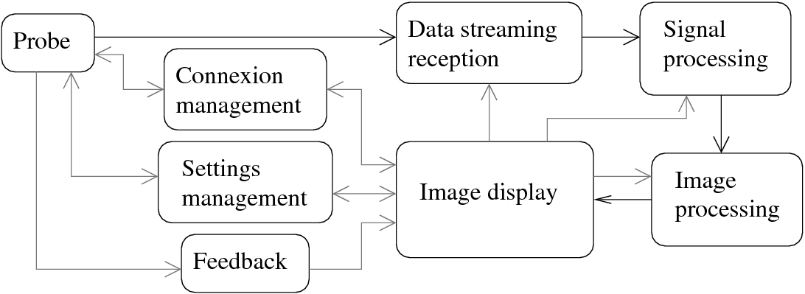

# echOpen lab tool
echOpen GUI software lab tool to test and develop signal processing algorithms.

## To start
### info
- Software tool [design brief](https://github.com/echopen/lab_tool/blob/master/DB_laboratory_tool_v2_en.pdf)
- Joining the team on echOpen slack [lab tool dedicated channel](https://echopen.slack.com/messages/CCGEF6CQY/)

### Note to contributors
- All contributors accept to send its contribution regarding the BSD-3 licence of the lab tool (see the licence in the repository)
- All contributors will develop and send code in the respect of the licence and not using any library without compliant licence
- All contributors will send its contribution through pull request

### Contact (lead dev)
- Jérôme (@GG23800)
- Clément (@clecoued)

## Architecture
The architecture of this software is described in figure below, it is composed of 7 principal modules:

- Connexion management: module that checks the connexion between the probe and the display software.
- Settings management: module that manages the settings between the probe and the display module.
- Feedback: module that manages the feedback from the probe.
- Data streaming reception: module that receives the data from the probe sends it the the signal processing module.
- Signal processing: module that applies the signal processing to each measurement line and sends it to image processing module.
- Image processing: module that determines the image.
- Image display: main window of the software where the image is displayed.
- The black lines represent the flux of the data from the probe to the displayed image. The gray lines represent the flux of settings and some informations such as feedback from the probe.

## Installing

First compile the probe emulator (./probe_emulator), see the [readme](./probe_emulator/readme.md) and launch it (use film option to have different image sends by the emulator, the other options will leads to loop on an unique image). The emulator can be stop with CTRL-C.

A first simple code can be found in the [RAW_tool](./RAW_tool) folder. This software connects to the probe emulator, receives an image, determine the envelope of each line and makes the scan conversion. The result is saved in a txt file.
